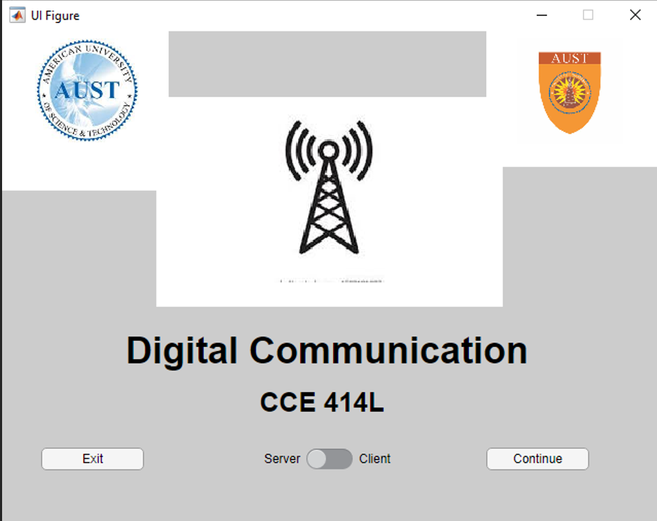
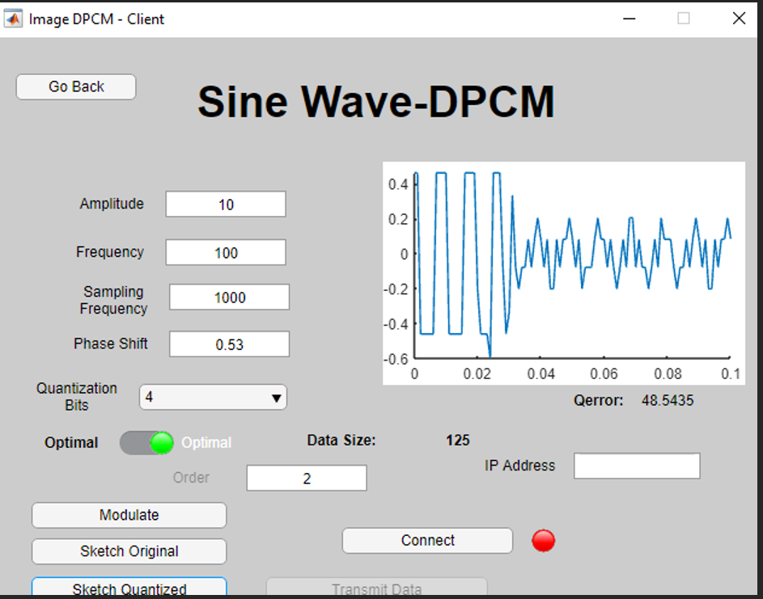
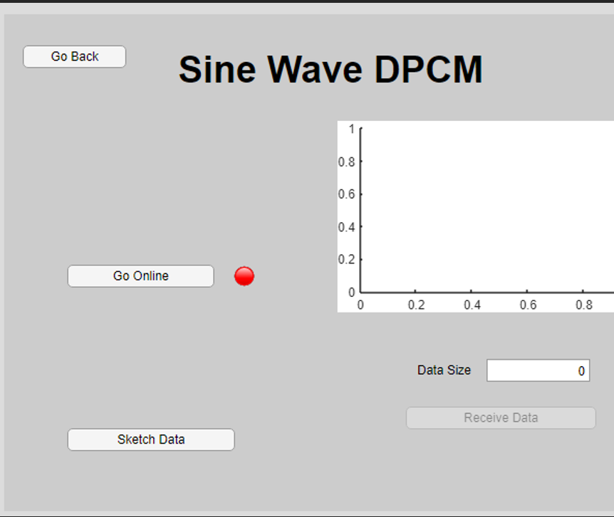
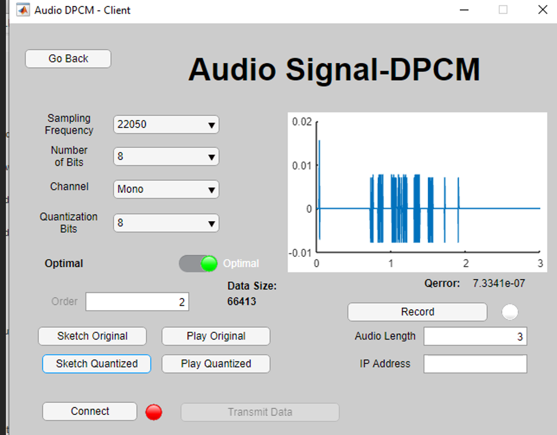

# 📡 Digital Communication System

An interactive MATLAB-based system for simulating PCM and DPCM digital communication with TCP/IP client-server architecture.

---

## 🚀 Overview

This project simulates digital communication techniques including:

- Pulse Code Modulation (PCM)
- Differential Pulse Code Modulation (DPCM)

It also demonstrates data transmission using a TCP/IP client-server model implemented in MATLAB.

---

## 🧠 Supported Signal Types

- Audio Signals
- Image Signals
- Sine Wave Signals

---

## ⚙️ System Components

- Signal generation and sampling
- Quantization and encoding (PCM / DPCM)
- TCP/IP communication (Client & Server)
- Signal reconstruction and analysis

---

## 🛠️ Technologies Used

- MATLAB
- Signal Processing
- Digital Communications
- TCP/IP Networking

---

## 📊 Features

- Simulation of PCM and DPCM systems
- Comparison between PCM and DPCM performance
- Client-server communication using TCP/IP
- Visualization of signals

---

## ▶️ How to Run

1. Open MATLAB
2. Run `ServerMain.mlapp`
3. Run `MainMenu.mlapp`
4. Choose signal type (Audio / Image / Sine)
5. Start client and server communication

---
## 📸 Preview

### Main Interface

### Client Interface

### Server Interface

### Example Result

## 📄 Notes

This project was developed as part of a university course in Digital Communication Systems.

## ⚠️ Limitations

- The system works correctly but may produce slight inaccuracies in some signal reconstructions.
- Further optimization can improve performance and accuracy.
